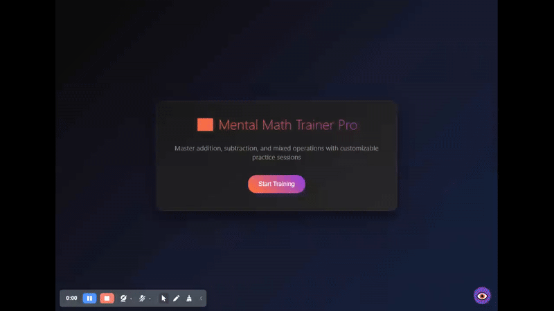

# 🧮 Mental Math Trainer Pro

*A free, offline, customizable mental math trainer designed for speed, accuracy, and user control — built for users who want a clean and focused tool.*

---

🔗 **Try Without Installation**: [GitHub Hosted Site](https://mathtrainerpro.github.io/MentalMathTrainerPro/)  
⬇️ **Download the App**: [GitHub Releases](https://github.com/MathTrainerPro/MentalMathTrainerPro/releases)

---

## 💡 Why I Built This

Most mental math tools today are:

- App-only and limited on desktop
- Filled with distractions or paywalls
- Missing serious customization for learners and educators

**Mental Math Trainer Pro** is my solution — a clean, fast, local-first math trainer with **full control**, designed to help users build accuracy, confidence, and speed in arithmetic without fluff.

---

## 🎯 Features at a Glance

- ➕ ➖ ✖️ ➗ **All Operations** — Including mixed-mode practice
- 🕒 **Practice Modes** — Timed or Fixed problem sets
- 🎚️ **Custom Ranges** — Control difficulty by setting number ranges
- 🚨 **Mistake Limits** — Fail/Restart rules for discipline-based learning
- 🔄 **Auto-Submit + Timeout** — Time-based pressure if desired
- 🔊 **Audio Feedback** — Success chimes, error buzzers
- 📊 **Live Stats** — Track accuracy and speed in real-time
- 📁 **Export Session Data** — Save your results as `.txt`
- 🧠 **Memory Modes** — Visual + audio-only training for mental retention
- 🎨 **Full Theme Customization** — Change colors, backgrounds, and UI style
- 💾 **No Account Needed** — All data saved locally via `localStorage`

---

## 🖼️ Demo Preview

---

## 🛠 Tech Stack

- **Vanilla JS + HTML/CSS**
- [Tone.js](https://tonejs.github.io/) for sound feedback
- [Chart.js](https://www.chartjs.org/) for real-time pie chart visuals
- No frameworks or build tools — everything runs client-side.

---

## 🔐 Privacy & Philosophy

- ❌ No ads  
- ❌ No tracking  
- ❌ No analytics  
- ✅ Everything works **offline**  
- ✅ Settings & history are stored **only on your machine**

> This app was built for clarity, not profit.

---

## 📬 Contact

Found a bug or want to suggest a feature?  
📧 **Email**: `PotatoSlicer18@protonmail.com`

---

## 📄 License

MIT License — free to use, fork, modify, and share.  
A credit is appreciated but not required.

---

> Built for learners. Designed for mastery. ✨
